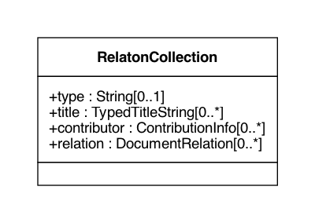

= The Relaton Bibliographic Models

These bibliographic models are developed to consolidate and standardize
the data models used for bibliographic and citation purposes.

These models are meant to be fully compatible with ISO 690 and
ISO TC 46's (and SC 4, SC 9) work on bibliography.

They are used extensively in the following projects as containers
for bibliographic data management and for managing document metadata:

* https://github.com/riboseinc/metanorma-model-iso[ISO Standards]
* https://github.com/riboseinc/metanorma-model-csd[CSD Standards]
* https://github.com/riboseinc/metanorma-model-gb[Chinese Standards (GB and family)]
* https://github.com/riboseinc/isobib[ISO bibliography gem]

Below are the UML diagrams.

The document models are expressed as UML and as RelaxNG Compact (RNC) grammars;
see discussion under
https://github.com/riboseinc/isodoc-models/tree/master/grammars[Grammars]. This
repository contains the RNC grammars for the base BibliographicItem model,
Citation model and the Contributor model.

The document models are currently used by IsoDoc-based authoring tools for
standards, which convert Asciidoctor source to XML representations of the
document models, and validate the XML generated against the RNC schemas:

* https://github.com/riboseinc/metanorma-iso
* https://github.com/riboseinc/metanorma-csd
* https://github.com/riboseinc/metanorma-gb

They are also used by tools that render those XML representations of the
document models, into HTML and Microsoft Word:

* https://github.com/riboseinc/isodoc
* https://github.com/riboseinc/metanorma-csd (inheriting from isodoc)
* https://github.com/riboseinc/metanorma-gb (inheriting from isodoc)

== Bibliography UML Models

=== Bibliographic Item

image::images/RelBib_BibliographicItem.png[]

=== Citation

image::images/RelBib_Citation.png[]

=== Contributor

image::images/RelBib_Contributor.png[]
image::images/RelBib_Contribution.png[]

=== Date

=== Document Relations

image::images/RelBib_DocumentRelation.png[]

=== Series

image::images/RelBib_Series.png[]

=== Data Types

image::images/RelBib_DataTypes.png[]

=== Collection

== Document Relations

=== Types

The document relation types are to be understood as follows:

obsoletes:: The document described in the main record supersedes
the document in the relation, which is no longer valid.
updates:: The document described in the main record is an update
of the document in the relation, which may or may not still be valid.
(By default in the standards world, it is not.)
updatedBy:: The document described in the main record is updated by
the document in the relation.
complements:: The document described in the main record is
complementary to the document in the relation, and provides additional
or contextual information to help understand the document in the relation.
derivedFrom:: The document described in the main record is
derived from the document in the relation.
translatedFrom:: The document described in the main record is a
translation of the document in the relation.
adoptedFrom:: The document described in the main record corresponds
to the document in the relation, and has been adopted in response to it.
Typically it is a national standard body's counterpart to an international
standard.
equivalent:: The document described in the main record corresponds
to the document in the relation, and is equivalent to it in force and scope,
though not in content. It is typically a subclass of the `adoptedFrom` relation.
identical:: The document described in the main record corresponds
to the document in the relation, is equivalent to it in force and scope,
and is identical to it in content. It is typically a subclass of the `adoptedFrom` relation.
nonequivalent:: The document described in the main record corresponds
to the document in the relation, but is not equivalent to it in force and scope.
It is typically a subclass of the `adoptedFrom` relation.
includedIn:: The document described in the main record is a part (component) of the
document in the relation (the host document); for example, chapter vs book, paper vs journal or
proceedings, record track vs record. In general, text-based resources have components 
that can be considered a 
different kind of resource; components of non-textual resources are considered 
to be of the same type as their host.
includes:: The document described in the main record contains the
document in the relation. This is the inverse relation to `includedIn`.
instance:: The document described in the main record is a generic reference
to a work, and the document described in the relation is an instance of that
work; for example, a specific edition or version of the main record.
This is used for example to represent the relation bewteen generic ISO standards,
and references to a particular edition of a standard, such as ISO 690 vs
ISO 690:2010.
partOf:: The document described in the main record is a multi-part document,
and the document described in the relation is one of those parts. For example,
ISO 639 refers to the ISO standard for language names; it has three parts
ISO 639-1 (two-letter codes), ISO 639-2 (three-letter codes for major languages), 
and ISO 639-3 (three-letter codes for all natural languages). This relation
is equivalent to `includes`, but is specific to multi-part textual documents, and
understands the including and included documents to be of the same type.
hasDraft:: The document described in the main record is a generic reference
to a work (whether published or pre-published), and the document described
in the relation is specific pre-publication version of the work. Is used to
collect information about different drafts of a work, and gateway stages of standards,
in the one record.

=== Relation scope

The relation between two items can include a locality element.
This is used to indicate part of the first item is related to the second;
for example, which part of the first item is superseded by the second.
The locality in the relation element can be used with `includedIn` relations, 
to indicate the extent of the 
contained item within the host item; but for consistency, it is preferable to
use the `extent` element in the contained item, which has the same meaning.

=== Redundancy in related docuemnts.

Many of the relations are between documents that are closely related, and can
be considered different levels or forms of representation of the same content.
This applies to a lesser extent to:
`obsoletes, updates, updatedBy, derivedFrom, nonequivalent, instance`;
it applies to a greater extent to: `translatedFrom, adoptedFrom,
identical, equivalent, hasDraft`. (The remaining relations, `complements,
includedIn, includes, partOf`, involve part-whole relations, which do not
identify the two records in any way.)

Inasmuch as the related records represent the same content, they will have many of
the same attributes in common, particularly title and authorship, and potentially
also identifier, publisher, and abstract. It is not necessary to repeat the same
information in the main and the related record: depending on the relation type,
the common elements will usually be understood. If for example `hasDraft` is used
to represent the various stages a standards document has gone through to date,
the records contained in the `hasDraft` relations do not need to repeat the
authors, publishers, abstract, or title given in the main record: typically
the document identifier for the particular draft, and the date the draft was
circulated, should be sufficient.

== Dates

Dates in Relaton are of different types. The following definitions should be understood
with particular relation to standards documents..

`:issued:`::
The date on which the standard was issued (authorised for publication by the issuing authority).

`:published:`::
The date on which the standard was published (distributed by the publisher).

`:implemented:`::
The date on which the standard became active.

`:created:`::
The date on which the first version of the standard was created.

`:updated:`::
The date on which the current version of the standard was updated.

`:obsoleted:`::
The date on which the standard was obsoleted/revoked.

`:confirmed:`::
The date on which the standard was reviewed and approved by the issuing authority.

`:unchanged:`::
The date on which the standard was last renewed without any changes in content.

`:circulated:`::
The date on which the unpublished standard was last circulated officially as a preprint. For standards, this is associated with the latest transition to a formally defined preparation stage, such as Working Draft or Committee Draft.

With relation to other classes of document, typically only the `published` date is of interest.
