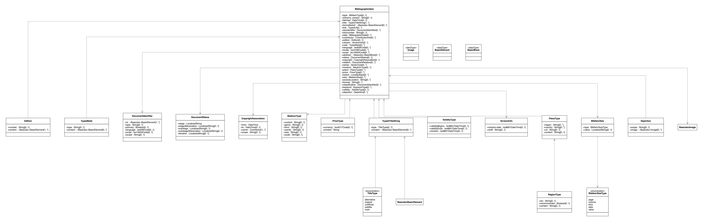
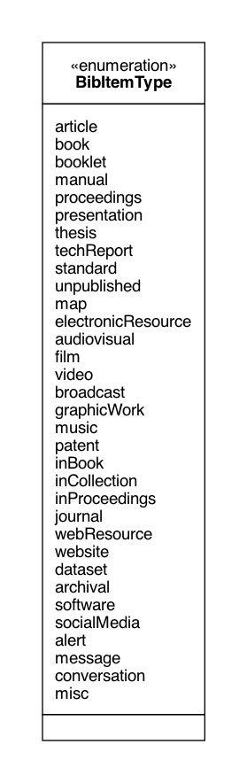
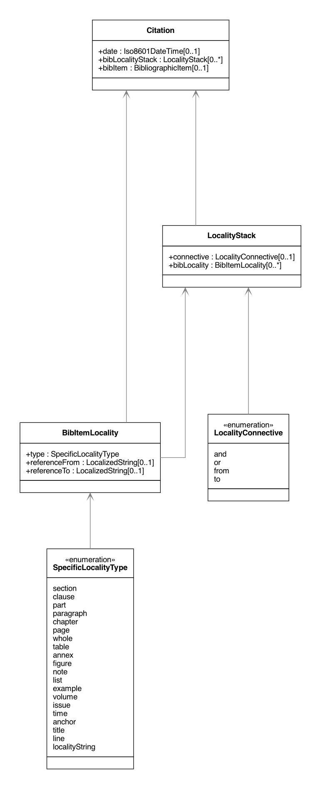
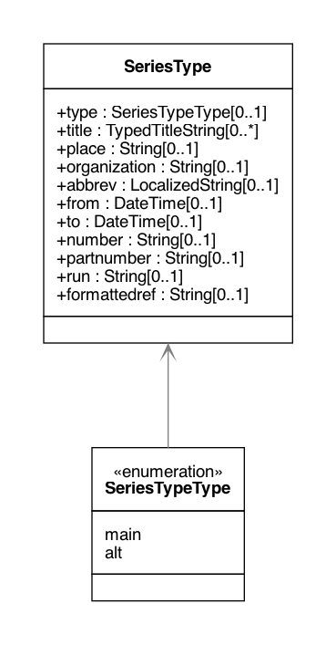
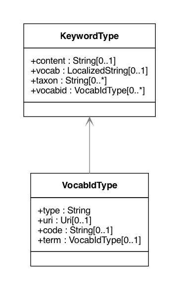

= The Relaton Bibliographic Models

These bibliographic models are developed to consolidate and standardize
the data models used for bibliographic and citation purposes.

These models are meant to be fully compatible with ISO 690 and
ISO TC 46's (and SC 4, SC 9) work on bibliography.

They are used extensively in the following projects as containers
for bibliographic data management and for managing document metadata:

* https://github.com/metanorma/metanorma-model-iso[ISO Standards]
* https://github.com/metanorma/metanorma-model-cc[CalConnect Standards]

Below are the UML diagrams.

The document models are expressed as LutaML-UML and as RelaxNG Compact (RNC) grammars;
see discussion under
https://github.com/metanorma/metanorma-model-iso/tree/master/grammars[Grammars]. This
repository contains the RNC grammars for the base BibliographicItem model,
Citation model and the Contributor model.

== Bibliography UML Models

=== Bibliographic Item

=== Bibliographic Item Types

=== Citation

=== Contributor

image::images/RelBib_Contributor.png[]
image::images/RelBib_Contribution.png[]

=== Date

image::images/RelBib_Date.png[]

=== Document Relations

=== Series

=== Keyword

=== Data Types

image::images/RelBib_DataTypes.png[]

=== Collection

image::images/RelBib_Collection.png[]

== Example

[source,xml]
----
<bibdata type="standard">
  <title language="en" format="plain">Collaboration Agreement between CalConnect and ISO/TC 211</title>
  <uri type='xml'>standards/csd-datetime-explict/csd-datetime-explict.xml</uri>
  <uri type='html'>standards/csd-datetime-explict/csd-datetime-explict.html</uri>
  <uri type='relaton'>standards/csd-datetime-explict/cc-18001.xml</uri>
  <docidentifier>CD 18XX</docidentifier>
  <date type='published'><on>2018-10-17</on></date>

  <contributor>
    <role type="author"/>
    <organization>
      <name>CalConnect</name>
    </organization>
  </contributor>
  <contributor>
    <role type="publisher"/>
    <organization>
      <name>CalConnect</name>
    </organization>
  </contributor>

  <language>en</language>
  
  <status format="plain">draft</status>
  <copyright>
    <from>2018</from>
    <owner>
      <organization>
        <name>CalConnect</name>
      </organization>
    </owner>
  </copyright>
  <editorialgroup>
    <technical-committee>PUBLISH</technical-committee>
  </editorialgroup>

  <relation type='partOf'>
    <bibdata type='governance'>
      <title>Standard document requirements</title>
      <uri type='xml'>standards/csd-document-requirements/csd-document-requirements.xml</uri>
      <docidentifier>CC/DIR 10002</docidentifier>
      <date type='updated'><on>2018-10-17</on></date>
      <status>proposal</status>
      <technical-committee>TC PUBLISH</technical-committee>
    </bibdata>
  </relation>

</bibdata>
----

== Document Relations

=== Relation scope

The relation between two items can include a locality element.
This is used to indicate part of the first item is related to the second;
for example, which part of the first item is superseded by the second.
The locality in the relation element can be used with `includedIn` relations,
to indicate the extent of the
contained item within the host item; but for consistency, it is preferable to
use the `extent` element in the contained item, which has the same meaning.

=== Redundancy in related documents

Many of the relations are between documents that are closely related, and can
be considered different levels or forms of representation of the same content.
This applies to a lesser extent to:
`obsoletes, updates, updatedBy, derivedFrom, nonequivalent, instance`;
it applies to a greater extent to: `translatedFrom, adoptedFrom,
identical, equivalent, hasDraft`. (The remaining relations, `complements,
includedIn, includes, partOf`, involve part-whole relations, which do not
identify the two records in any way.)

Inasmuch as the related records represent the same content, they will have many of
the same attributes in common, particularly title and authorship, and potentially
also identifier, publisher, and abstract. It is not necessary to repeat the same
information in the main and the related record: depending on the relation type,
the common elements will usually be understood. If for example `hasDraft` is used
to represent the various stages a standards document has gone through to date,
the records contained in the `hasDraft` relations do not need to repeat the
authors, publishers, abstract, or title given in the main record: typically
the document identifier for the particular draft, and the date the draft was
circulated, should be sufficient.

The following is an example of a description of a document, an instance of the document,
and a draft of the instance. The document is ISO 20483, and its description is intended
to apply generically to all editions (instances) of the document, including the 2006 and 2013
editions. The specific edition described is the 2013 edition, and the draft of the 2013 edition is
the working draft. (The 2013 edition description also links to the 2006 edition description, which
it supersedes.)

Those attributes that are common to all three levels of description,
such as the title and the publisher, are stated only once, at the top level; the attributes that apply at
lower levels, such as edition and abstract for the edition, and circulation date and status for the draft,
are stated once at the first level they apply to. If an
attribute value is overridden between levels of description, such as docidentifier,
both the base value and the override value are given in their respective levels.

[source,xml]
----
<bibitem type="international-standard" id="ISO20483-2013">
  <title format="text/plain" language="en" script="Latn">Cereals and pulses -- Determination of the nitrogen content and calculation of the crude protein content -- Kjeldahl method</title>
  <title format="text/plain" language="fr" script="Latn">Céréales et légumineuses -- Détermination de la teneur en azote et calcul de la
teneur en protéines brutes -- Méthode de Kjeldahl</title>
  <docidentifier type="ISO">ISO 20483</docidentifier>
  <contributor>
    <role type="publisher"/>
    <organization>
      <name>International Organization for Standardization</name>
      <abbreviation>ISO</abbreviation>
      <uri>www.iso.org</uri>
    </organization>
  </contributor>
  <language>en</language>
  <language>fr</language>
  
  <editorialgroup>
    <technical_committee number="34" type="TC">ISO/TC 34/SC 4 Cereals and pulses</technical_committee>
  </editorialgroup>
  <ics>
    <code>67.060</code>
    <text>Cereals, pulses and derived products</text>
  </ics>

  <relation type="instance">
    <bibitem type="international-standard" id="ISO20483-2013">
      <uri type="src">https://www.iso.org/standard/59162.html</uri>
      <uri type="obp">https://www.iso.org/obp/ui/#!iso:std:59162:en</uri>
      <uri type="rss">https://www.iso.org/contents/data/standard/05/91/59162.detail.rss</uri>
      <docidentifier type="ISO">ISO 20483:2013</docidentifier>
      <date type="published">
        <on>2013</on>
      </date>
      <edition>2</edition>
      <abstract format="plain" language="en" script="Latn">ISO 20483:2013 specifies a method for the determination of the nitrogen content of cereals, pulses and derived products, according to the Kjeldahl method, and a method for calculating the crude protein content. The method does not distinguish between protein nitrogen and non-protein nitrogen.</abstract>
      <abstract format="plain" language="fr" script="Latn">L'ISO 20483:2013 spécifie une méthode pour la détermination de la teneur en azote dd
    es céréales, des légumineuses et des produits dérivés, selon la méthode de Kjeldahl, ainsi qu'une méthode de calcul de la teneur en prr
    otéines brutes. La méthode ne fait pas la distinction entre l'azote protéique et l'azote non protéique.</abstract>
      <copyright>
        <from>2013</from>
        <owner>
          <organization>
            <name>ISO</name>
          </organization>
        </owner>
      </copyright>
      <relation type="obsoletes">
        <bibitem>
          <formattedref>ISO 20483:2006</formattedref>
        </bibitem>
      </relation>

      <relation type="instance">
        <bibitem type="international-standard" id="ISO20483-2013">
          <docidentifier type="ISO">ISO 20483 (WD):2013</docidentifier>
          <date type="circulated">
            <on>2013-01-02</on>
          </date>
          <status>
            <stage>20</stage>
            <substage>00</substage>
          </status>
        </bibitem>
      </relation>
    </bibitem>
  </relation>
</bibitem>
----

