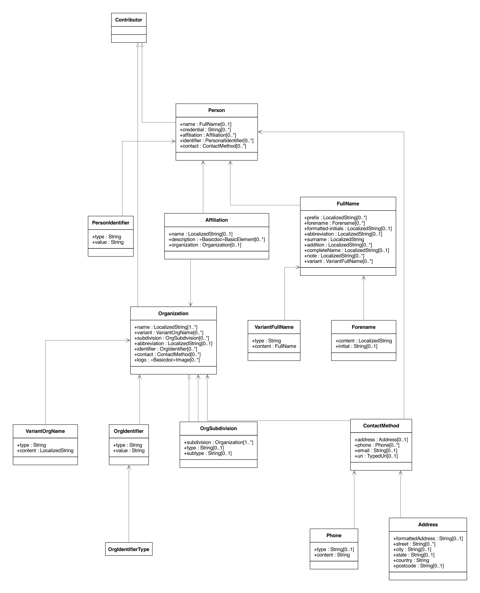
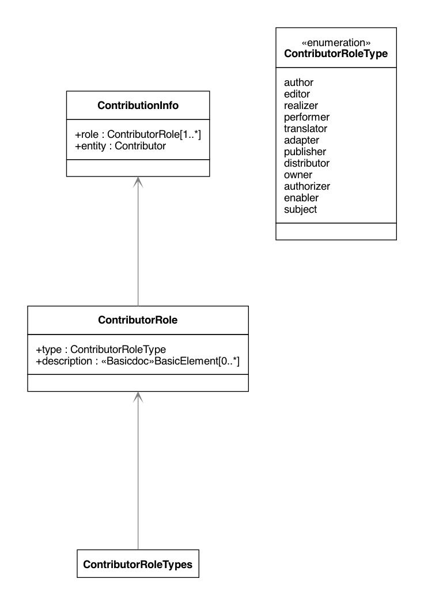

= The Relaton Bibliographic Models

These bibliographic models are developed to consolidate and standardize
the data models used for bibliographic and citation purposes.

These models are meant to be fully compatible with ISO 690 and
ISO TC 46's (and SC 4, SC 9) work on bibliography.

They are used extensively in the following projects as containers
for bibliographic data management and for managing document metadata:

* https://github.com/riboseinc/metanorma-model-iso[ISO Standards]
* https://github.com/riboseinc/metanorma-model-csd[CSD Standards]
* https://github.com/riboseinc/metanorma-model-gb[Chinese Standards (GB and family)]
* https://github.com/riboseinc/isobib[ISO bibliography gem]

Below are the UML diagrams.

The document models are expressed as UML and as RelaxNG Compact (RNC) grammars;
see discussion under
https://github.com/riboseinc/isodoc-models/tree/master/grammars[Grammars]. This
repository contains the RNC grammars for the base BibliographicItem model,
Citation model and the Contributor model.

The document models are currently used by IsoDoc-based authoring tools for
standards, which convert Asciidoctor source to XML representations of the
document models, and validate the XML generated against the RNC schemas:

* https://github.com/riboseinc/metanorma-iso
* https://github.com/riboseinc/metanorma-csd
* https://github.com/riboseinc/metanorma-gb

They are also used by tools that render those XML representations of the
document models, into HTML and Microsoft Word:

* https://github.com/riboseinc/isodoc
* https://github.com/riboseinc/metanorma-csd (inheriting from isodoc)
* https://github.com/riboseinc/metanorma-gb (inheriting from isodoc)

== Bibliography UML Models

=== Bibliographic Item

image::images/RelBib_BibliographicItem.png[]

=== Citation

image::images/RelBib_Citation.png[]

=== Contributor

=== Date

image::images/RelBib_Date.png[]

=== Document Relations

image::images/RelBib_DocumentRelation.png[]

=== Series

image::images/RelBib_Series.png[]

=== Data Types

image::images/RelBib_DataTypes.png[]

== Collection

image::images/RelBib_Collection.png[]
